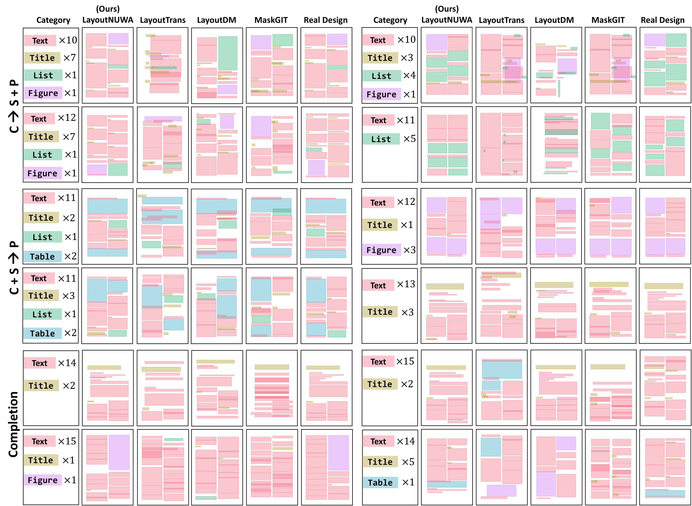

# LayoutNUWA: Revealing the Hidden Layout Expertise of Large Language Models
We propose LayoutNUWA, the first model that treats layout generation as a code generation task to enhance semantic information and harnesses the hidden layout expertise of large language models. 
<p align="center">  
    
</p>  

## Model Performance
### Generated Cases
We sample some generated cases by LayoutNUWA on the PubLayNet datasets.
<p align="center">  
    
</p> 

### Automatic Evaluation
#### Magazine Dataset
<p align="center">  
    
</p> 

#### RICO and PubLayNet Dataset
<p align="center">  
    
</p> 

## Setup

We check the reproducibility under this environment.
- Python 3.9.18
- CUDA 11.6

### Environment Installation

Prepare your environment with the following command
```Shell
git clone https://github.com/ZetangForward/LayoutNUWA.git
cd LayoutNUWA

conda create -n layoutnuwa python=3.9
conda activate layoutnuwa

pip install -r requirements.txt
```

### Model Preparation
We utilize [LLaMA2-7B](https://huggingface.co/meta-llama/Llama-2-7b) and [CodeLLaMA-7B](https://huggingface.co/codellama/CodeLlama-7b-hf) as our backbone.
You can download the models and place them under the ``./models`` directory.

### Dataset Preparation

#### [Rico](https://interactionmining.org/rico) and [PubLayNet](https://developer.ibm.com/exchanges/data/all/publaynet/) Dataset

Please follow [https://raw.githubusercontent.com/CyberAgentAILab/layout-dm](https://raw.githubusercontent.com/CyberAgentAILab/layout-dm) to download the preprocessed datasets, FID and clustering models. 

``Notice``: **make sure you are under the LayoutNUWA directory**
``` Shell
wget https://github.com/CyberAgentAILab/layout-dm/releases/download/v1.0.0/layoutdm_starter.zip
unzip layoutdm_starter.zip
```

The data is decompressed to the following structure:
```Shell
download
- clustering_weights
- datasets
- fid_weights
- pretrained_weights
```

Then, move the **download files** to the corresponding directory according to the below commond:

```Shell
# preprocessed datasets
mv download/datasets/rico25-max25 data
mv download/datasets/publaynet-max25 data

# rico fid and clustering models
mkdir -p models/rico25-max25
mv download/fid_weights/FIDNetV3/rico25-max25 models/rico25-max25
mv download/clustering_weights/rico25_max25_kmeans_train_clusters.pkl models/rico25-max25

# publaynet fid and clustering models
mkdir -p models/publaynet-max25
mv download/fid_weights/FIDNetV3/models/publaynet-max25 models/publaynet-max25
mv download/clustering_weights/publaynet_max25_kmeans_train_clusters.pkl models/publaynet-max25
```

#### [Magazine](https://xtqiao.com/projects/content_aware_layout/) Dataset

1.  Download `MagLayout.zip` and decompress it.
2.  Create the new directory `data/magazine/raw/` and move the contents into it as shown below:

    ```dircolors
    data/magazine/raw/
    └── layoutdata
        ├── annotations
        │   ├── fashion_0001.xml
        │   ├── fashion_0002.xml
        │   ├── fashion_0003.xml
        │   ├── fashion_0004.xml
        │   ├── fashion_0005.xml
        │   ├── ...
    ```
3. Please follow [https://github.com/ktrk115/const_layout/tree/master/data](https://github.com/ktrk115/const_layout/tree/master/data) and [https://github.com/CyberAgentAILab/layout-dm/blob/main/docs/custom_dataset.md](https://github.com/CyberAgentAILab/layout-dm/blob/main/docs/custom_dataset.md) to preprocess the raw datasets and train the FID as well as the clustering models.


## Numerical Layout to Code Format Conversion
You can run the following command to generate the code data for the RICO dataset

``NOTICE``: if you want to generate code for two other datasets (publaynet and magazine), just modify the ``--dataset_name``, ``--dataset_path``, and ``--save_path``.

### Build Training Data
```Shell
python convertHTML/build_code.py \
    --model_path_or_name /path/to/llamamodel \
    --dataset_name rico25 \
    --dataset_path data/rico25-max25 \
    --save_path data/rico25-max25/html_format \
    --bbox_quantization code \
    --consistency_num 10 \
    --add_task_instruction;
```

### Build Testing Data
```Shell
python convertHTML/build_code.py \
    --model_path_or_name /path/to/llamamodel \
    --dataset_name rico25 \
    --dataset_path data/rico25-max25 \
    --save_path data/rico25-max25/html_format \
    --bbox_quantization code \
    --add_task_instruction \
    --build_testing_set;
```

## Model Training and Inference
We customize the training code based on the [LLaMA-X](https://github.com/AetherCortex/Llama-X)

### Training
Please Check ``trainer/src/configs/hostfile`` and ``trainer/src/configs/deepspeed_config_2.json`` first, where the current code is designed for 64 NVIDIA V100 GPUs (8 GPUs x 8 nodes).
```Shell
cd trainer/src/scripts
bash scripts/train.sh
```

### Inference
```Shell
cd trainer/src/scripts
bash scripts/inference.sh
```

## Evaluation
You can run the following command to evaluate the generated results for the RICO dataset (We have released generated results of RICO dataset in ``data/generated_results/rico`` as an example).

```Shell
python evaluate.py \
    --file_dir data/generated_results/rico \
    --intermediate_saved_path data/generated_results/rico/all_gen.pt \
    --golden_file data/generated_results/rico/golden.jsonl \
    --fid_model_name_or_path models/rico25-max25 \
    --cluster_model models/rico25-max25/rico25_max25_kmeans_train_clusters.pkl \
    --dataset_name rico25 \
    --dataset_path data/rico25-max25 \
```

``NOTICE``: just replace the dataset name, path and the path of generated results if you want to evalute other datasets.


## Acknowledgement
We appreciate the open source of the following projects:

[Hugging Face](https://github.com/huggingface) &#8194;
[LLaMA-X](https://github.com/AetherCortex/Llama-X) &#8194;
[LayoutDM](https://github.com/CyberAgentAILab/layout-dm) &#8194; 
[Const Layout](https://github.com/ktrk115/const_layout) &#8194; 